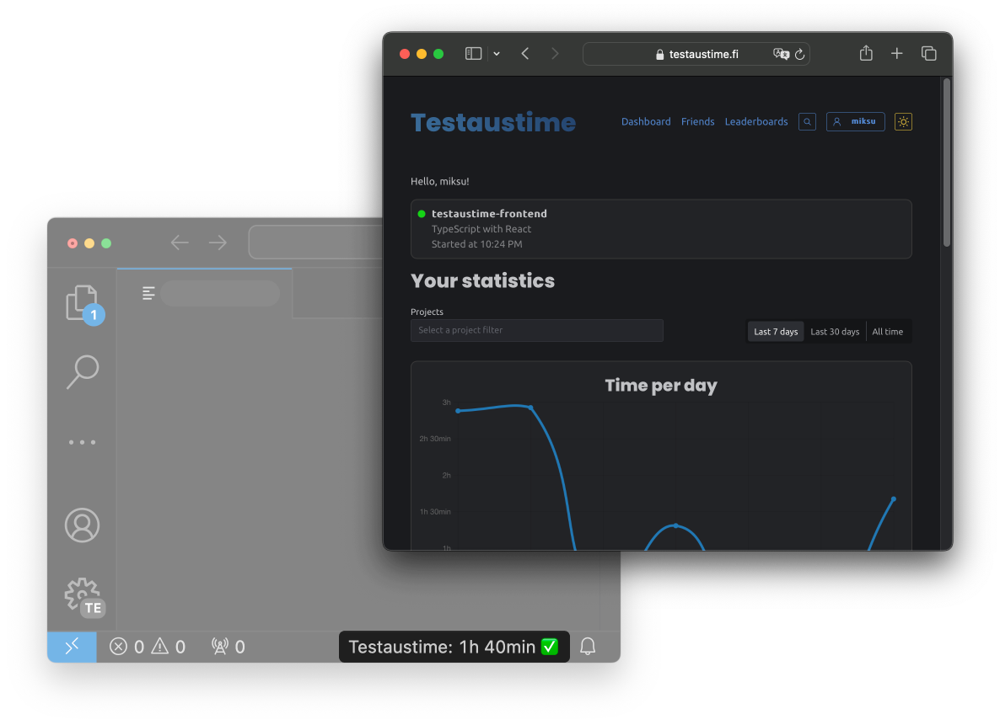

# Testaustime Visual Studio Code extension

Testaustime is the ultimate tool for tracking time of your coding sessions. Show the world how dedicated you are to your projects, now available for Visual Studio Code!

Sign up for an account at https://testaustime.fi/register.

## How to use?

1. Open the command palette `CTRL+SHIFT+P` 
2. Select `Testaustime: Log in using browser`
3. Log in

Green check mark in status bar indicates that Testaustime is actively tracking your coding session. Click on the indicator to open testaustime.fi in your browser.

You can configure more by searching `testaustime` in Visual Studio Code settings.
